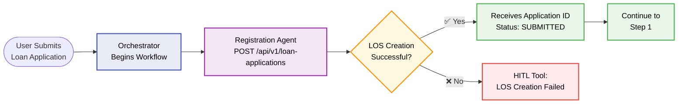
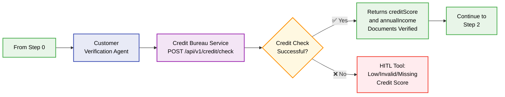
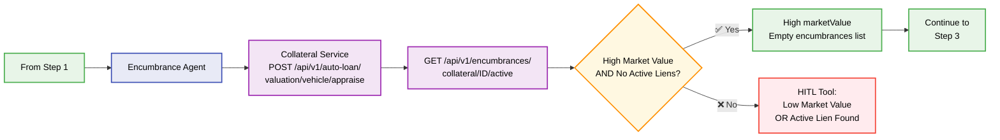
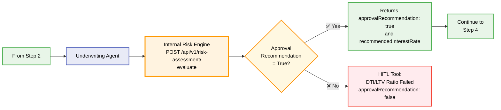
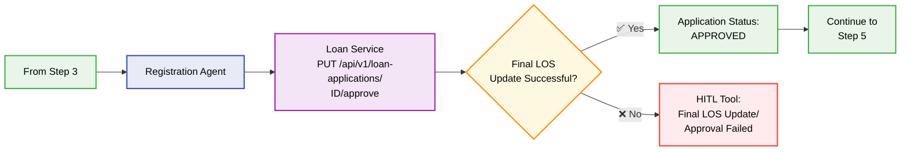
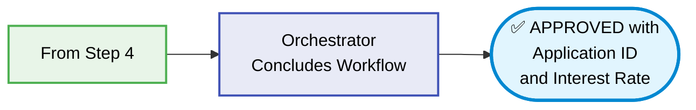

# Loan Application Demo Flow

This document contains a Mermaid diagram showing the complete flow of the loan application demo process, including all agents, API endpoints, success criteria, and failure paths.

## High-Level Workflow Overview

```mermaid
flowchart LR
    Start([User Submits<br/>Loan Application]) --> Step0[Step 0: Initial<br/>Submission]
    Step0 --> Step1[Step 1: Verification &<br/>Credit Check]
    Step1 --> Step2[Step 2: Collateral &<br/>Lien Check]
    Step2 --> Step3[Step 3: Risk<br/>Decision Gate]
    Step3 --> Step4[Step 4: Final<br/>Registration]
    Step4 --> Step5[Step 5: Final<br/>Outcome]
    Step5 --> End([APPROVED])
    
    %% Styling
    classDef process fill:#e3f2fd,stroke:#1976d2,stroke-width:2px,color:#000000
    classDef endpoint fill:#f3e5f5,stroke:#7b1fa2,stroke-width:2px,color:#000000
    
    class Step0,Step1,Step2,Step3,Step4,Step5 process
    class Start,End endpoint
```

## Step 0: Initial Submission

## Step 1: Verification & Credit Check

## Step 2: Collateral & Lien Check

## Step 3: Risk Decision Gate (CRITICAL)

## Step 4: Final Registration

## Step 5: Final Outcome

## Workflow Summary

### Agents and Their Roles:
- **Orchestrator**: Manages the overall workflow
- **Registration Agent (LOS)**: Handles loan application registration and final approval
- **Customer Verification Agent (CVA)**: Performs credit checks and document verification
- **Encumbrance Agent (EA)**: Handles collateral valuation and lien checks
- **Underwriting Agent (UA)**: Performs risk assessment
- **Registration Agent (RA)**: Finalizes loan registration

### API Endpoints:
1. `POST /api/v1/loan-applications` - Initial loan application creation
2. `POST /api/v1/credit/check` - Credit bureau verification
3. `POST /api/v1/auto-loan/valuation/vehicle/appraise` - Vehicle appraisal
4. `GET /api/v1/encumbrances/collateral/{collateralId}/active` - Active lien check
5. `POST /api/v1/risk-assessment/evaluate` - Risk assessment evaluation
6. `PUT /api/v1/loan-applications/{id}/approve` - Final loan approval

### Success Flow:
Application → Credit Check → Collateral & Lien Verification → Risk Assessment → Final Approval → APPROVED

### Failure Points & HITL Tools:
Each step has defined failure conditions that trigger Human-in-the-Loop intervention for manual review and decision-making.

## API Projects for Demo Simulation

- Loan Service: https://github.com/rjtmahinay/loan-service
- Credit Bureau Service: https://github.com/rjtmahinay/credit-bureau-service
- Collateral Service: https://github.com/rjtmahinay/collateral-service 
- Internal Risk Engine Service: https://github.com/rjtmahinay/internal-risk-engine-service
